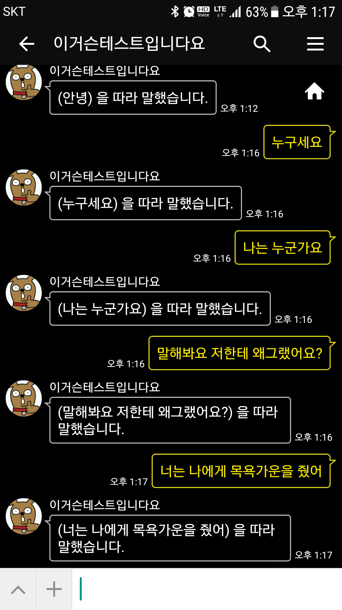

# kakao_autoreply_with_naver_tts
# 카카오톡 자동응답(챗봇) 서비스와 네이버 TTS의 합체 코드

<pre>
카카오 톡 프렌즈에다가 입력한 텍스트를
서버에서 네이버 TTS(음성합성)을 이용해 출력해주는 것입니다.

실제... 일반 서버에선 필요 없겠지만...
라즈베리 파이에 적용해서 사용해볼 생각입니다.

즉, 카톡에다 입력하면 라즈베리 파이(서버)가 그대로 읽어주게 말이죠.
이 코드는 네이버의 "미진이"가 보통 속도("0")로 읽어주는 샘플 코드입니다.

코드는 동작하는 코드이지만
네이버 API ID & Key를 할당받아 적용해야 합니다.

</pre>

~~~~

환경 변수에 네이버 KEY를 추가해주세요.
터미널
$ export NAVER_TTS_ID=asdfsadf
$ export NAVER_TTS_SECRET=asdfsadf
~~~~

필요한 패키지들은 다음과 같습니다.
~~~~
//speaker 설치 필요
$ sudo apt-get install libasound2-dev
[적용 폴더]$ npm init -y
[적용 폴더]$ npm install lame
[적용 폴더]$ npm install speaker
[적용 폴더]$ npm install request
[적용 폴더]$ npm install body-parser
[적용 폴더]$ npm install express
~~~~

##실행 방법
~~~
$node kakao_naver_tts.js
~~~

http://chandong83.blog.me/221065166712
